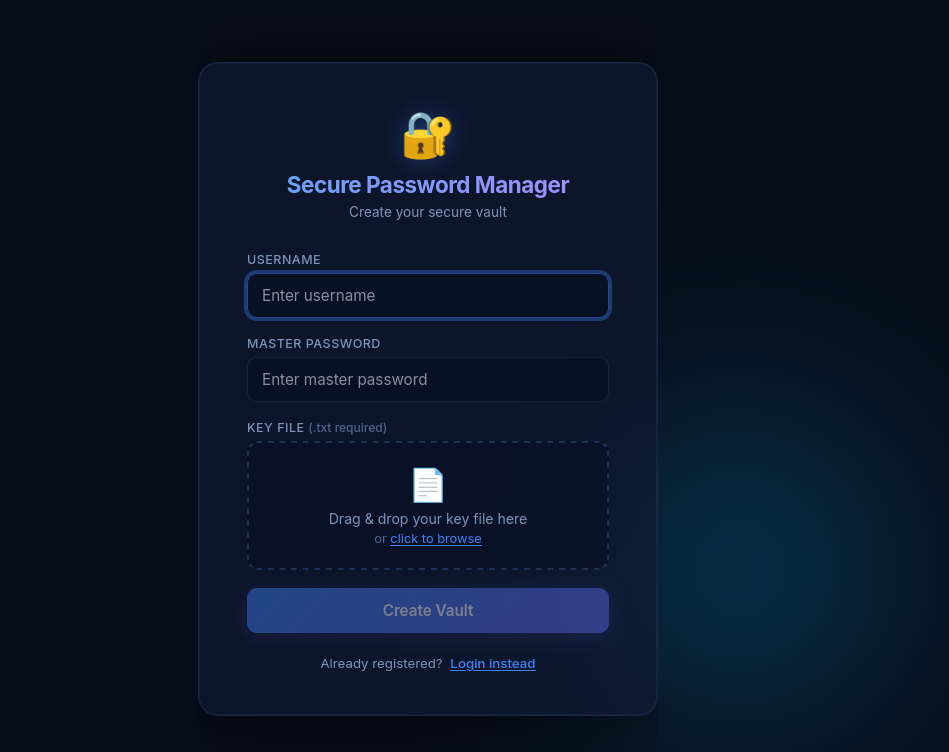
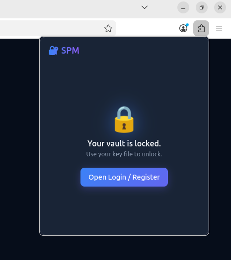
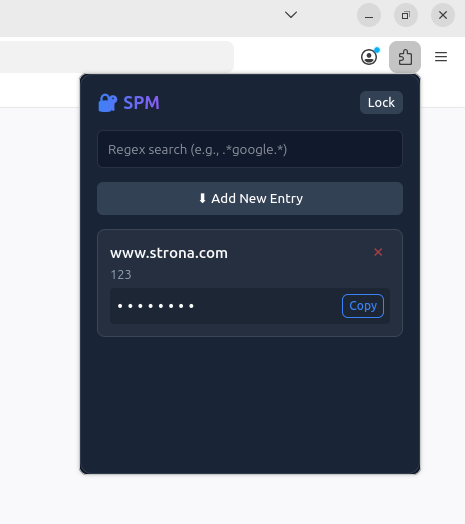
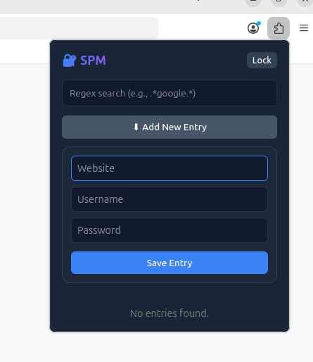

# Zespół: Wiktor Miśkowiec, Miłosz Ziemba

# Wtyczka 

Dokumentacja projektu wtyczki managera haseł do przeglądarki Firefox\Chrome.
## Struktura

```text
/
├── manifest.json
├── backend/
│   ├── background.js
│   └── crypto_utils.js
└── frontend/
    ├── auth.html
    ├── auth.css
    └── auth.js
    └── autofill.js
    ├── popup.html
    ├── popup.css
    └── popup.js
```

## Konfiguracja - manifest.json

Na poziomie głównym plik manifest.json pełni rolę jedynego punktu wejścia oraz planu konfiguracyjnego dla silnika przeglądarek.
* Uprawnienia (Permissions): Określają wymagane zakresy dostępu, jawnie ograniczając rozszerzenie wyłącznie do możliwości storage i tabs.
* Powiązanie tła (Background Binding): Nakazuje przeglądarce automatyczne załadowanie komponentów backendu (backend/crypto_utils.js oraz backend/background.js).
* Powiązanie akcji (Action Binding): Łączy akcję przeglądarki z wyświetleniem widoku frontend/popup.html w izolowanym, tymczasowym kontekście interfejsu użytkownika.

## Ekrany

Ekran rejestracji użytkownika



Ekran locked out



Ekran wyszukiwana odblokowywany przez powyższe



Ekran dodania



## Funkcjonalność - idea

Master password przy rejestracji wymaga spełnienia
- dłuższe niż 8 znaków
- przynajmniej jedna mała litera
- przynajmniej jedna duża litera
- przynajmniej jedna cyfra
- przynajkniej jeden znak specjalny

Hasło przy rejestracji rozszerzane przez losową salt - Uint8[16].

Dodatkowo oprócz hasła rejestrowany jest plik stanowiący klucz dodatkowej autoryzacji wykorzystywany analogicznie konwertowany na liczbę.


Weryfikacja użytkownika jest
- dokonywana przez SHA-256 tworzonego dla (password+salt+file)
- ważna przez 15 minut
- możliwość wczesnego zakończenia sesji
- na czas trwania przechowuję klucze sesji

Klucze sesji stanowią klucz powstały z password oraz drugi powstały z file

Każdy klucz jest:
- tworzony po weryfikacji użytkownika
- używany do enkrypcji i dekrypcji haseł
- 256-bit klucz AES-GCM
- tworzony z password + salt / file + salt2
- tworzony przy użyciu PBKDF2
- przechodzi 100 000 iteracji
- wykorzystuje hash SHA-256
- używany do szyfrowania i odszyfrowania

Szyfrowanie/odszyfrowanie danych opiera się na
- kluczach sesji
- losowej wartości iv
- dwuetapowe - kluczem sesji 1 -> kluczem sesji 2

## Endpointy

Funkcjonalność analogiczna do powyższego opisu

* register - rejestracja
* login - login
* logout - wczesniejsze zakończenie sesji
* delete_entry - usunięcie danych
* add_entry - dodanie danych
* search_entries - wyszukiwanie danych
* get_credentials_for_url - auto uzupełnianie danych w przeglądarce

## Bezpieczeństwo

Backend wykrywa rodzaj zapytania przychodzącego na API przeglądarki przez wartość message.action = X.

Zarówno login i rejestracja otwierają nową karte - wybór plików jest niemożliwy w tej samej karcie, przeglądarka zapomina który plik wybrano...

### Register

Zapytanie obsługiwane przez ```handleRegister``` które tworzy wymagania regex co do możliwego hasła, dodatkowo wymaga zdefniowania pliku klucza dalej używanego w rejestracji. Tworzone są także dwie wartości ```salt i salt2```, a plik zostaje zamieniony na liczbę. Hash dalej używany do autoryzacji przy logowaniu jest tworzony na podstawie powyższych jako ```verify=hash(password+salt+file)```. Wartości ```salt,salt2,verify,username``` zostają zapisane w pamięci przeglądarki, dodatkowo tworzone są klucze sesji ```sessionKey i sessionKey2``` używane do zapisu i odczuty danych.

Oba klucze tworzone analogicznie, na podstawie innych danych ```password i salt, file i salt2```.  Kluczę tworzymy wykorzystująć PBKDF2 uwzględniając odpowiednie salt - w celu wykazania odporności na tablice teńczowe. Wykonujemy 100 000 iteracji - znaczące utrudnienie dla stylu Brute Force. Generujemy klucz długości 256bit typu AES-GCM pozwalający na szyfrowanie i odszyfrowanie.

Zarówno w autoryzacji jak i tworzeniu klucza wykorzystano SHA-256 jako standardowe rozwiązanie.

### Login

Zapytanie obsługiwane przez ```handleLogin``` które sprawdza authData w danych, w celu sprawdzenia czy dokonano rejestracji (1. uruchomienie po dodaniu wtyczki). Na podstawie podanej w formu nazwy użytkownika pobiera wartości salt, salt2, verify oraz tworzy odpowiedni hash i porównuje czy hash=auth. Jeśli tak tworzone są klucze sesji ```sessionKey i sessionKey2```. Login uruchamia zegar automatycznego timeoutu sesji.

Nawet w przypadku przejęcia urządzenia, które pozwala na forsowne zalogowanie, hasła pozostają bezpieczne, zaszyfrowane. 

### Dodawanie do bazy

Zapytanie obsługiwane przez ```handleAddEntry``` które sprawdza czy istnieją klucze sesji.  Zapisujemy obiekt opart o ```hostname, username, password``` danego serwisu. Generujemy losowe wartości ```iv1 i iv2```, następnie AES-GCM szyfruję dane wykorzystująć ```sessionKey, iv1```, dalej obiekt złożony z uzyskanej wartości i iv1 szyfrujemy ponownie przez AES-GCM i tym razem ```sessionKey2, iv2```. Uzyskaną wartość zapisujemy razem z ```iv2```.

Rozwiązanie pozwala na bezpieczne szyfrowanie i odszyfrowanie. Wartości ```iv``` wykorzystane w celu uniemożliwienia wnioskowania o haślie na podstawie wartości zapisanych. Wykorzystano je w obu etapach by w sytuacji wycieku jednego elementu: hasło/plik, dalej zachować te własnosć.

Zamiast pliku trzymanego na urządzeniu jako 2FA, lepsze byłoby wykorzystanie typu YubiKey które odpowiada na wyzwania uniemożliwając wyciek przez ciągłe podsumowanie urządzenia przez atakującego.

Autorzy niestety nie posiadają ;|

### Auto uzupełnianie

Zapytanie obsługiwane przez ```handleGetCredentialsForUrl```, sprawdzamy czy dla obecnej strony mamy zapisane ```hostname``` w bazie. Przeglądamy elementy zaszyfrowane, przez co jest to skuteczne tylko gdy oba klucze sesji są aktywne.

## Instalacja

### Firefox about:debugging

W opcji dodaj tymczasową wtyczkę wybieramy plik ```manifest.json```.

### Firefox developer

### Chrome

## Testy


## Technologie

* ManifestV3
* API przeglądarki
* html
* css
* js
* Web Crypto API
* PBKDF2
* AES-GCM (256-bit)
* Losowy IV
* Salt
* SHA-256
* JSON
* Base64 encoding